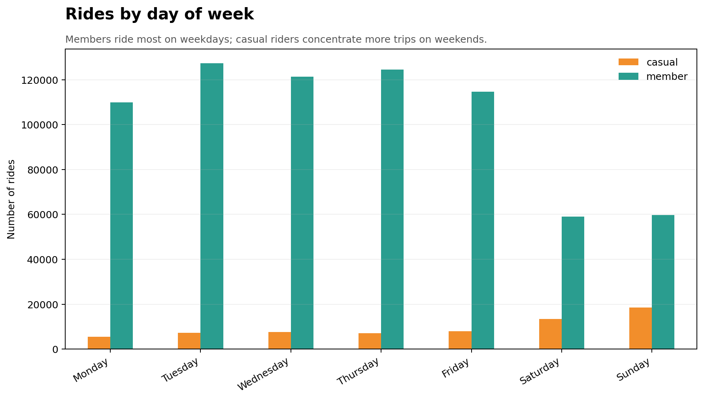
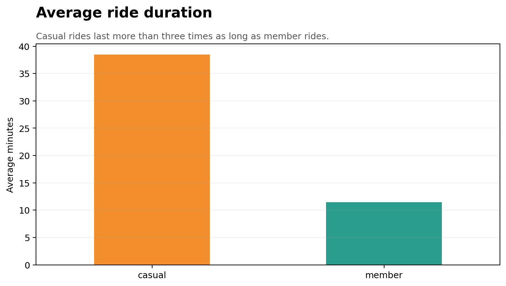
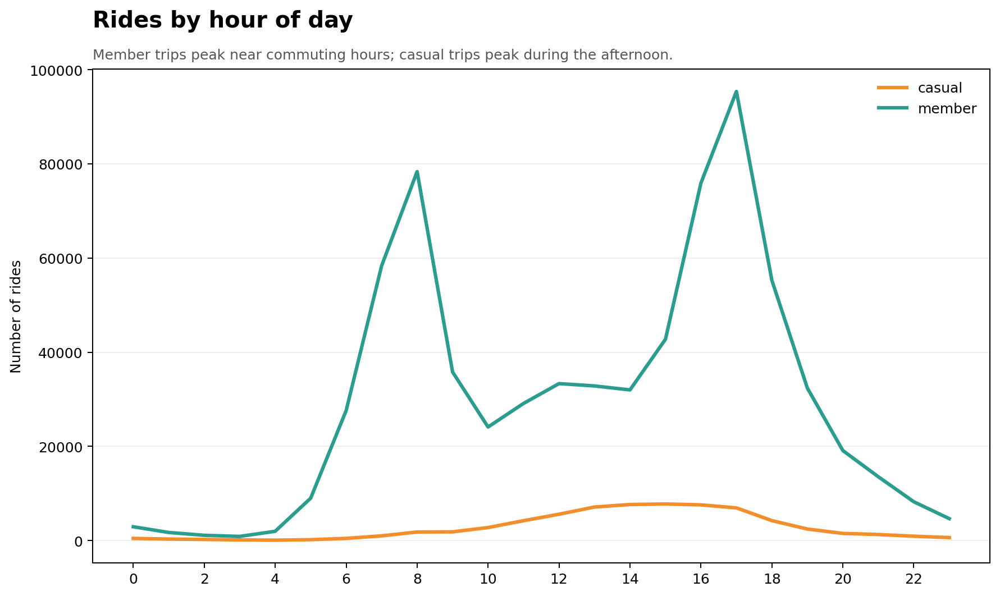

# 📊 Google Data Analytics Capstone Project

## Case Study
This case study is part of my Google Data Analytics Professional Certificate capstone project. The goal of this project is to apply the complete data analysis process to a real-world business problem and develop data-driven recommendations.

## 🔎 Ask
### Business Task

Analyze Cyclistic's historical bike-trip data to identify how casual riders and annual members use the service differently. These insights will help the marketing team develop strategies to convert casual riders into annual members.

### Key Stakeholders

- Lily Moreno, Director of Marketing
- Cyclistic Marketing Analytics Team
- Cyclistic Executive Team
- Cyclistic casual riders and annual members

## 📁 Prepare

### Data Source

The analysis uses Divvy trip data from the first quarters of 2019 and 2020. The public datasets were provided by Motivate International Inc. and downloaded from the Divvy Trip Data repository.

- 2019 Q1: 365,069 trips
- 2020 Q1: 426,887 trips
- Total: 791,956 trips

The files contain trip dates, stations, ride duration, and rider type. Personal identifying information is not included. The two datasets use different column names and structures, so the columns must be standardized before combining them.

### Limitations

The analysis compares only the first quarter of 2019 with the first quarter of 2020. Therefore, the results do not represent a complete year or all seasonal riding patterns.

## 🧹 Process

### Tools

Python and Pandas were used to clean, standardize, combine, and analyze the datasets.

### Cleaning Process

- Renamed the 2019 columns to match the 2020 structure.
- Changed `Subscriber` to `member` and `Customer` to `casual`.
- Converted start and end times to datetime format.
- Created `ride_length`, `day_of_week`, and `month` columns.
- Checked for duplicate ride IDs; none were found.
- Removed records with missing essential information.
- Removed rides shorter than one minute or longer than 24 hours.
- Combined both datasets into one dataframe.

After cleaning, 783,803 of the original 791,956 trips remained for analysis.

## 📈 Analyze
### Key Findings

- Members completed 716,406 rides, representing 91.4% of all cleaned trips.
- Casual riders completed 67,397 rides, representing 8.6% of trips.
- Casual rides averaged 38.48 minutes, compared with 11.47 minutes for members.
- Casual riders took their longest rides on Wednesdays and Sundays.
- Casual riding was highest on weekends; 47.3% of casual trips occurred on Saturday or Sunday.
- Member use was concentrated on weekdays, especially Tuesday through Thursday.
- Member activity peaked around 8:00 AM and 5:00 PM, suggesting commuting behavior.
- Casual activity peaked between 2:00 PM and 4:00 PM, suggesting leisure use.

### Summary

Members generally take shorter, more frequent weekday trips that resemble commuting. Casual riders take longer trips and ride more often on weekends and during afternoon leisure hours.

## 📊 Share
### Visualizations

The visualizations show that members ride mainly during weekday commuting hours. Casual riders take longer trips and use the service more frequently on weekends and during the afternoon.

## ✅ Act
### Recommendations

1. Promote annual memberships through social media campaigns on weekends and during afternoon hours, when casual riders are most active.
2. Offer casual riders a limited-time membership trial or discount after completing several long rides.
3. Create marketing messages that show how an annual membership can provide value for both weekend recreation and regular transportation.

### Conclusion

Casual riders mainly use Cyclistic for longer recreational trips, while members use the service more frequently for shorter weekday trips. Targeted promotions and membership incentives could help convert casual riders into annual members.
